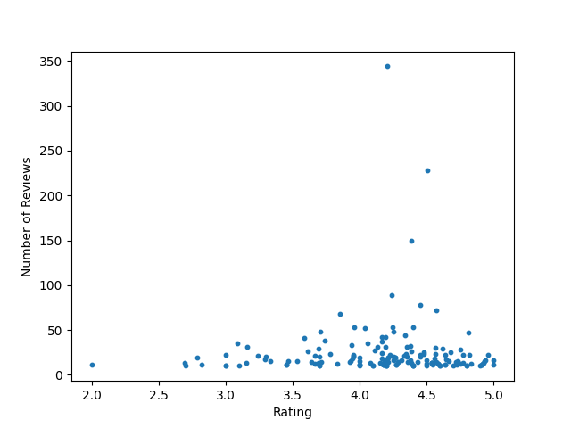
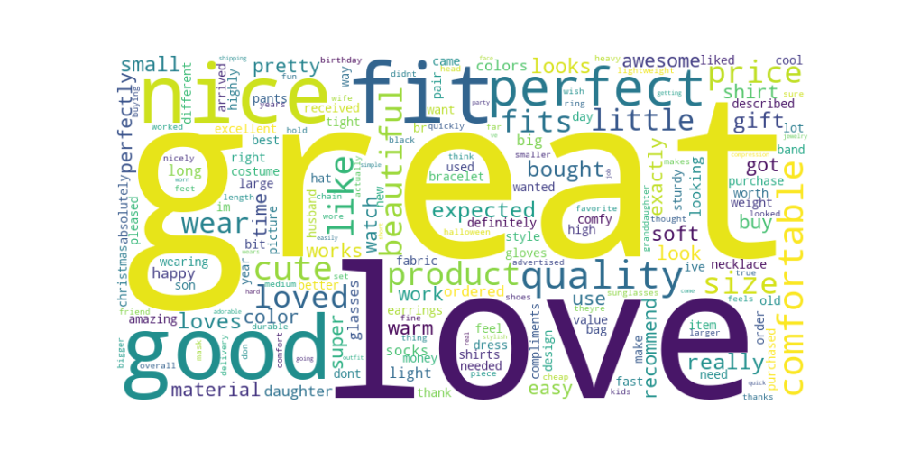
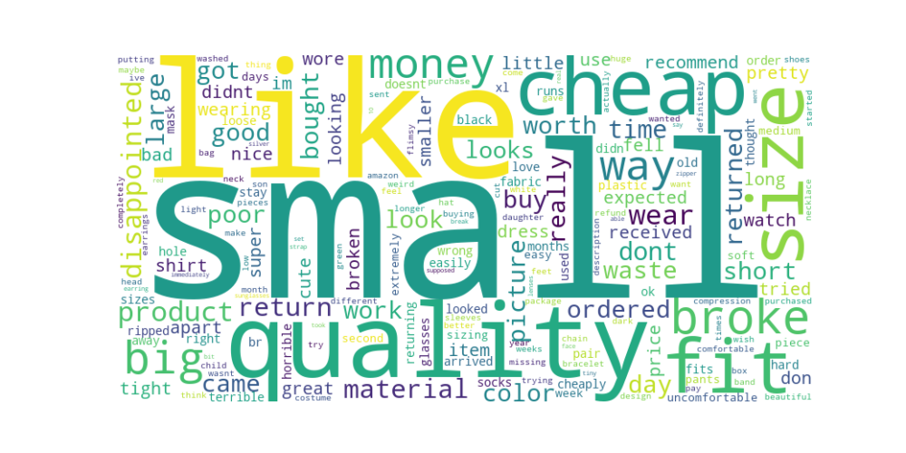
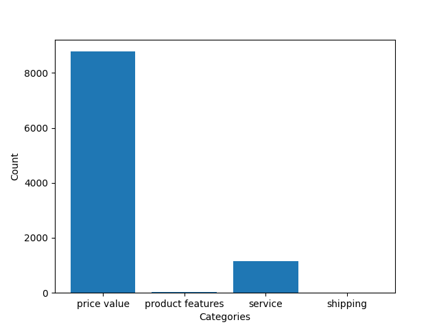
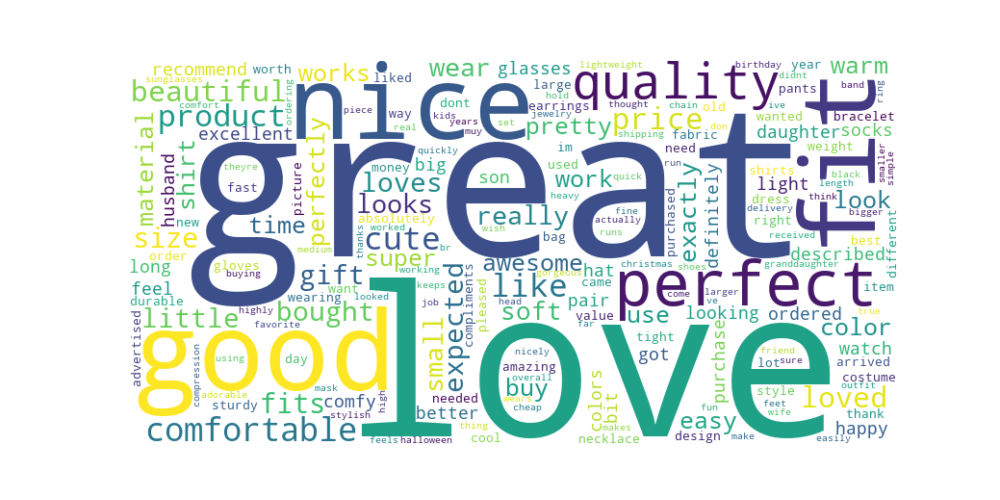
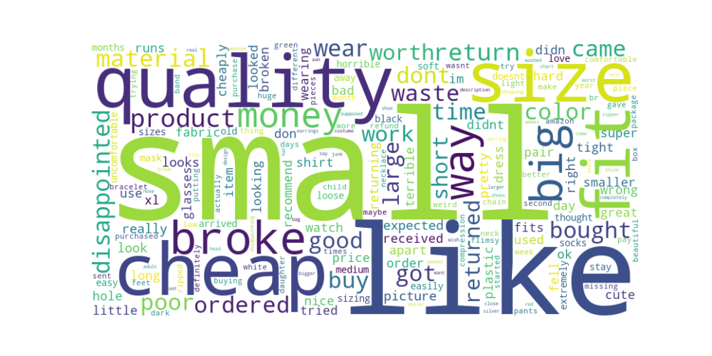

# Data Analytics Report

## Introduction
This report provides an analysis of the dataset. The data is visualized through various plots to highlight key insights and trends. Below are the visualizations with relevant interpretations.

---

## Dataset Overview

- **Dataset**: Amazon Fashion
- **Number of Records**: 827,192 rows raw, 10,000 processed

Due to heavy computational costs (due to the use of LLMS), we would randomly sample 10,000 rows from raw data for showcasing purposes.
---

## What to look out for customer satisfaction?

**Interpretation**:  
Most of the stores have a pretty high review ratings (around 4-4.5). For stores with a large number of ratings, it can be seen that they have very good ratings as well. This makes sense to us as customers would continue to stick with stores that are well-received by others.

---

## What do customers usually say?

**Interpretation**:  
Most of customers' concerns are focused on the quality of the products. The emphasis seems to be placed more on the product itself, compared to miscellaneous factors like features of the commercial platform.

---

## What are customers most concerned about?

Most reviews tend to focus on product quality rather than other factors. To enhance customer satisfaction more effectively, we suggest that commercial platforms implement stricter policies to regulate the sellers they permit on their platform. The following factors can serve as a guideline for commercial platforms to monitor in order to maintain product quality.

### Now lets look at what customers say in the most important categories

**Interpretation**:  
Size is a key factor that customers consider when making a purchase. We define quality as the material used in the product, which significantly impacts customer satisfaction. To ensure this, commercial platforms must prioritize ethical and reputable sellers. Upholding this standard of quality can serve as a unique selling point, boosting both customer retention and satisfaction.

---

## Conclusion

Based on the analysis and the visualizations, we can conclude that:

1. Product Quality Matters Most: Customers primarily focus on product quality, particularly the material used, which directly influences their satisfaction.

2. Platform Regulation: To improve customer satisfaction, commercial platforms should enforce stricter policies to ensure they partner with ethical and reputable sellers.

3. Size and Quality Are Key: Size and material quality are critical factors for customers when making a purchase, and these should be closely monitored by platforms.

4. High Ratings Indicate Trust: Stores with high ratings, especially those with a large number of reviews, tend to attract and retain customers due to their positive reputation.

5. Review Focus: Reviews mainly emphasize product quality over other factors, indicating that product-related concerns are the primary focus for customers.

Further analysis may include clustering based on domain-specific features depending on stakeholder priorities (e.g. Product aesthetics).

---

## References and Tools used

- [Hugging face](https://huggingface.co/) transformers for text processing/classification.
- [PostgreSQL](https://www.postgresql.org/) database for handling review product relationships.

---

